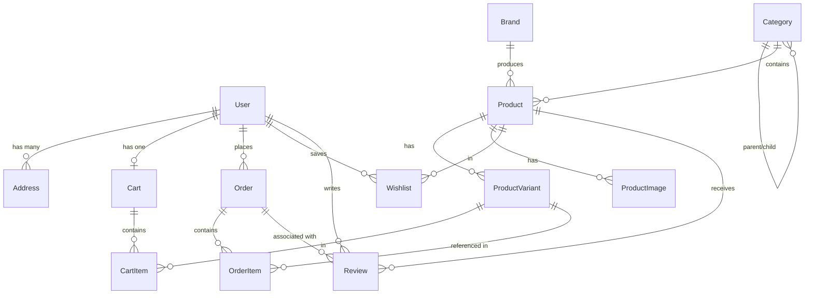

# Dokumentasi Skema Database ByteStore

Dokumen ini merupakan dokumentasi permanen untuk perancangan basis data PostgreSQL pada platform **ByteStore** menggunakan **Prisma ORM**. Seluruh keputusan arsitektur, spesifikasi kolom, tipe native database, relasi antar tabel, dan aturan bisnis didokumentasikan di sini sebagai acuan pengembangan.

---

## 1. Ikhtisar Arsitektur Basis Data

- **Database Engine**: PostgreSQL
- **ORM**: Prisma ORM v7 (dengan driver adapter PostgreSQL `@prisma/adapter-pg`)
- **Primary Key**: `String` (`UUID`, otomatis *generated* via `@default(uuid())`) pada semua model untuk keunikan terdistribusi dan keamanan.
- **Audit Timestamps**: Setiap model utama memiliki field `createdAt` (`DateTime @default(now())`) dan `updatedAt` (`DateTime @updatedAt`).

---

## 2. Diagram Relasi Entitas (ERD)

---

## 3. Enumerasi (Enums)

### 1. Enum `Role`
Pilihan peran untuk kontrol akses pengguna:
- `CUSTOMER` (default): Pembeli umum.
- `ADMIN`: Pengelola toko dan verifikator pesanan.

### 2. Enum `OrderStatus`
Siklus status transaksi pesanan:
- `PENDING` (default): Pesanan dibuat, menunggu transfer pembeli (batas 24 jam).
- `VERIFYING`: Pembeli telah upload bukti bayar, menunggu verifikasi manual admin.
- `PAID`: Pembayaran diverifikasi oleh admin, pesanan diproses.
- `SHIPPED`: Pesanan dikirim via kurir dengan nomor resi.
- `COMPLETED`: Pesanan telah diterima pembeli.
- `CANCELLED`: Dibatalkan otomatis (timeout 24 jam) atau manual.

---

## 4. Spesifikasi Skema Database Lengkap

### A. Manajemen Pengguna

**1. Model `User`**
- `id`: `String` (`UUID`, otomatis *generated*) - Primary key unik.
- `name`: `String` (`@db.VarChar(255)`) - Nama lengkap pengguna.
- `email`: `String` (`@db.VarChar(255)`), harus unik.
- `password`: `String` (`@db.VarChar(255)`) - Hash password (bcrypt).
- `role`: Enum `Role` dengan nilai `CUSTOMER` (default) atau `ADMIN`.
- `createdAt`: `DateTime` (`@default(now())`).
- `updatedAt`: `DateTime` (`@updatedAt`).
- *Relasi*: Memiliki banyak `Address`, satu `Cart`, banyak `Order`, banyak `Wishlist`, dan banyak `Review`.

**2. Model `Address`**
- `id`: `String` (`UUID`, otomatis *generated*) - Primary key unik.
- `userId`: `String` (`UUID`) - Relasi ke tabel `User` (onDelete: Cascade).
- `fullAddress`: `String` (`@db.Text`) - Nama jalan, RT/RW, kota, provinsi, kode pos.
- `isDefault`: `Boolean` (Default `false`).
- `createdAt`: `DateTime` (`@default(now())`).
- `updatedAt`: `DateTime` (`@updatedAt`).
- *Relasi*: Milik satu `User`.

---

### B. Katalog Produk

**3. Model `Category`**
- `id`: `String` (`UUID`, otomatis *generated*) - Primary key unik.
- `name`: `String` (`@db.VarChar(100)`) - Nama kategori.
- `parentId`: `String` (`UUID`) - Opsional. Relasi rekursif ke tabel `Category` (onDelete: SetNull).
- `createdAt`: `DateTime` (`@default(now())`).
- `updatedAt`: `DateTime` (`@updatedAt`).
- *Relasi*: Memiliki kategori induk (`parent`), banyak subkategori (`children`), dan banyak `Product`.

**4. Model `Brand`**
- `id`: `String` (`UUID`, otomatis *generated*) - Primary key unik.
- `name`: `String` (`@db.VarChar(100)`) - Nama merk/brand produsen.
- `createdAt`: `DateTime` (`@default(now())`).
- `updatedAt`: `DateTime` (`@updatedAt`).
- *Relasi*: Memiliki banyak `Product`.

**5. Model `Product`**
- `id`: `String` (`UUID`, otomatis *generated*) - Primary key unik.
- `name`: `String` (`@db.VarChar(255)`) - Nama produk.
- `description`: `String` (`@db.Text`) - Deskripsi detail produk.
- `warrantyInfo`: `String` (`@db.VarChar(255)`) - Opsional, deskripsi masa garansi (contoh: "Resmi 3 Tahun").
- `isArchived`: `Boolean` (Default `false`) - Jika `true`, produk disembunyikan (soft delete).
- `categoryId`: `String` (`UUID`) - Relasi ke `Category` (onDelete: Restrict).
- `brandId`: `String` (`UUID`) - Relasi ke `Brand` (onDelete: Restrict).
- `createdAt`: `DateTime` (`@default(now())`).
- `updatedAt`: `DateTime` (`@updatedAt`).
- *Relasi*: Memiliki satu `Category`, satu `Brand`, banyak `ProductVariant`, banyak `ProductImage`, banyak `Review`, dan banyak `Wishlist`.

**6. Model `ProductVariant`**
- `id`: `String` (`UUID`, otomatis *generated*) - Primary key unik.
- `productId`: `String` (`UUID`) - Relasi ke `Product` (onDelete: Cascade).
- `name`: `String` (`@db.VarChar(150)`) - Contoh: "Warna Hitam", "Kapasitas 16GB".
- `sku`: `String` (`@db.VarChar(100)`) - Opsional, kode unik stok.
- `price`: `Decimal` (`@db.Decimal(12, 2)`) - Nilai harga produk.
- `stock`: `Int` (`@db.Integer`, default `0`) - Aturan Bisnis: Stok tidak boleh bernilai negatif.
- `createdAt`: `DateTime` (`@default(now())`).
- `updatedAt`: `DateTime` (`@updatedAt`).
- *Relasi*: Milik satu `Product`, direferensikan oleh `CartItem` dan `OrderItem`.

**7. Model `ProductImage`**
- `id`: `String` (`UUID`, otomatis *generated*) - Primary key unik.
- `productId`: `String` (`UUID`) - Relasi ke `Product` (onDelete: Cascade).
- `url`: `String` (`@db.VarChar(2048)`) - URL maksimal 2048 karakter.
- `isPrimary`: `Boolean` (Default `false`) - Penanda thumbnail utama.
- `sortOrder`: `Int` (`@db.Integer`, default `0`) - Untuk mengurutkan tampilan galeri.
- `createdAt`: `DateTime` (`@default(now())`).
- `updatedAt`: `DateTime` (`@updatedAt`).
- *Relasi*: Milik satu `Product`.

---

### C. Belanja & Transaksi

**8. Model `Cart`**
- `id`: `String` (`UUID`, otomatis *generated*) - Primary key unik.
- `userId`: `String` (`UUID`, unique) - Relasi 1-to-1 ke `User` (onDelete: Cascade).
- `createdAt`: `DateTime` (`@default(now())`).
- `updatedAt`: `DateTime` (`@updatedAt`).
- *Relasi*: Milik satu `User`, memiliki banyak `CartItem`.

**9. Model `CartItem`**
- `id`: `String` (`UUID`, otomatis *generated*) - Primary key unik.
- `cartId`: `String` (`UUID`) - Relasi ke `Cart` (onDelete: Cascade).
- `productVariantId`: `String` (`UUID`) - Relasi ke `ProductVariant` (onDelete: Cascade).
- `quantity`: `Int` (`@db.Integer`, default `1`).
- `createdAt`: `DateTime` (`@default(now())`).
- `updatedAt`: `DateTime` (`@updatedAt`).
- *Batasan*: Unique gabungan `[cartId, productVariantId]`.
- *Relasi*: Milik satu `Cart` dan mereferensikan satu `ProductVariant`.

**10. Model `Order`**
- `id`: `String` (`UUID`, otomatis *generated*) - Primary key unik.
- `invoiceNumber`: `String` (`@db.VarChar(50)`), harus unik - Nomor referensi transaksi ramah manusia (misal: INV-2026...).
- `userId`: `String` (`UUID`) - Relasi ke `User` (onDelete: Restrict).
- `status`: Enum `OrderStatus` - `PENDING`, `VERIFYING`, `PAID`, `SHIPPED`, `COMPLETED`, `CANCELLED` (Default: `PENDING`).
- `totalAmount`: `Decimal` (`@db.Decimal(12, 2)`) - Total belanja (barang + ongkir).
- `courier`: `String` (`@db.VarChar(50)`) - Nama layanan kurir, misal "Eco", "Cargo".
- `trackingNumber`: `String` (`@db.VarChar(100)`) - Opsional, nomor resi pengiriman.
- `eta`: `DateTime` (`@db.Timestamp(3)`) - Opsional, estimasi waktu tiba barang.
- `expiresAt`: `DateTime` (`@db.Timestamp(3)`) - Batas waktu 24 jam untuk auto-cancel pesanan jika belum dibayar.
- `shippingAddress`: `Json` (`@db.JsonB`) - Menyalin data JSON utuh dari alamat pada detik transaksi terjadi (snapshot).
- `createdAt`: `DateTime` (`@default(now())`).
- `updatedAt`: `DateTime` (`@updatedAt`).
- *Relasi*: Milik satu `User`, memiliki banyak `OrderItem` dan `Review`.

**11. Model `OrderItem` - SNAPSHOT**
- `id`: `String` (`UUID`, otomatis *generated*) - Primary key unik.
- `orderId`: `String` (`UUID`) - Relasi ke `Order` (onDelete: Cascade).
- `productVariantId`: `String` (`UUID`) - Relasi referensi ke `ProductVariant` (onDelete: Restrict).
- `productName`: `String` (`@db.VarChar(255)`) - Snapshot gabungan nama produk saat checkout.
- `price`: `Decimal` (`@db.Decimal(12, 2)`) - Snapshot harga aktual produk pada detik *checkout*.
- `quantity`: `Int` (`@db.Integer`) - Jumlah unit yang dibeli.
- `subtotal`: `Decimal` (`@db.Decimal(12, 2)`) - Hasil perkalian `quantity` x `price`.
- `createdAt`: `DateTime` (`@default(now())`).
- `updatedAt`: `DateTime` (`@updatedAt`).
- *Relasi*: Milik satu `Order`, mereferensikan satu `ProductVariant`.

---

### D. Fitur Pendukung

**12. Model `Wishlist`**
- `id`: `String` (`UUID`, otomatis *generated*) - Primary key unik.
- `userId`: `String` (`UUID`) - Relasi ke `User` (onDelete: Cascade).
- `productId`: `String` (`UUID`) - Relasi ke `Product` (onDelete: Cascade).
- `createdAt`: `DateTime` (`@default(now())`).
- `updatedAt`: `DateTime` (`@updatedAt`).
- *Batasan*: Unique gabungan `[userId, productId]`.
- *Relasi*: Milik satu `User` dan mereferensikan satu `Product`.

**13. Model `Review`**
- `id`: `String` (`UUID`, otomatis *generated*) - Primary key unik.
- `userId`: `String` (`UUID`) - Relasi ke `User` (onDelete: Cascade).
- `productId`: `String` (`UUID`) - Relasi ke `Product` (onDelete: Cascade).
- `orderId`: `String` (`UUID`) - Relasi ke `Order` (onDelete: Cascade).
- `rating`: `Int` (`@db.SmallInt`) - Nilai penilaian angka (1 sampai 5).
- `comment`: `String` (`@db.Text`) - Opsional, ulasan teks dari pembeli.
- `createdAt`: `DateTime` (`@default(now())`).
- `updatedAt`: `DateTime` (`@updatedAt`).
- *Relasi*: Menghubungkan satu `User`, satu `Product`, dan satu `Order`.

---

## 5. Aturan Bisnis & Rekayasa Perangkat Lunak

1. **Pencegahan Race Condition**:
   Saat proses *checkout* terjadi dan model `Order` dibuat, nilai `stock` pada model `ProductVariant` harus langsung dikurangi di dalam sebuah *database transaction* terpadu (`prisma.$transaction`) guna mencegah pembelian melebihi stok yang tersedia (*overselling*).

2. **Tanpa Logic Pembayaran Asli**:
   Cukup gunakan kolom `status` pada model `Order`. Tidak perlu model khusus untuk Payment Gateway karena verifikasi pembayaran dilakukan secara manual oleh admin.

3. **Hard Delete vs Soft Delete**:
   Jangan pernah membuat fungsionalitas hapus permanen (*hard delete*) untuk Produk yang sudah pernah dibeli. Gunakan kolom `isArchived` pada model `Product` untuk menyembunyikannya dari katalog publik.

4. **Snapshot Pattern**:
   - Nilai `price` dan `productName` di `OrderItem` merupakan snapshot statis agar perubahan data katalog di masa depan tidak mengubah histori transaksi masa lalu.
   - Kolom `shippingAddress` pada `Order` menyimpan salinan data alamat lengkap saat transaksi terjadi.

5. **Storage Adapter (RFC 0004)**:
   Untuk kolom `url` pada model `ProductImage`, pastikan sistem penyimpanan berkas menggunakan folder lokal (`public/uploads/`) saat lingkungan *Development* dan Vercel Blob saat lingkungan *Production*.
