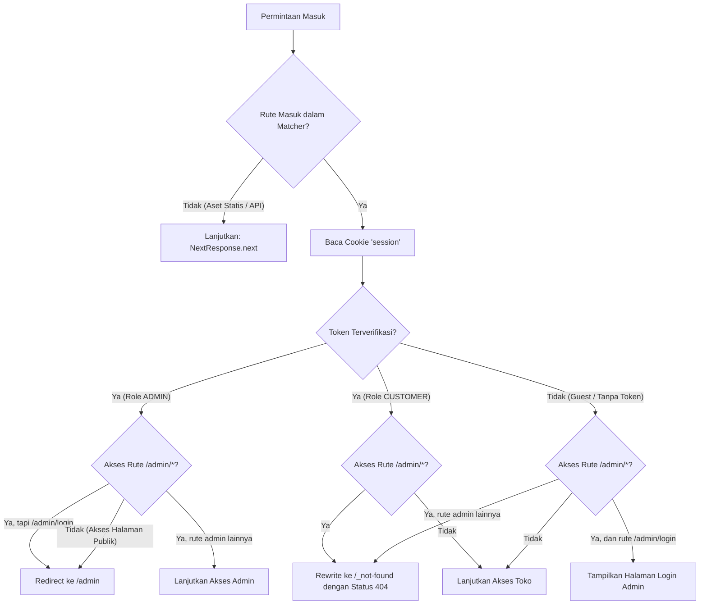

# Arsitektur Otorisasi dan Isolasi Hak Akses (Route & Data Protection)

Dokumen ini menjelaskan arsitektur, cara kerja, dan aturan proteksi akses di ByteStore. Terdapat dua lapisan keamanan utama: **Edge Middleware** (`src/middleware.ts`) untuk memisahkan rute UI secara ketat, dan **Server-Side Authorization Guard** (`src/lib/server-auth.ts`) untuk melindungi operasi data CRUD.

---

## 1. Tujuan dan Prinsip Keamanan

Sistem otentikasi dan otorisasi ByteStore menganut prinsip pemisahan tugas (*separation of concerns*) dan keamanan berbasis ketidaktampakan (*security through obscurity* pada rute privat):

1. **Isolasi Penuh Antar Peran**:
   - Akun staf/admin murni digunakan untuk mengelola katalog, inventaris, dan transaksi di `/admin`. Staf dilarang dan dicegah dari mengakses halaman belanja atau publik.
   - Akun pelanggan/customer hanya diperbolehkan menjelajahi etalase toko dan bertransaksi.
2. **Kerahasiaan Struktur Rute Admin**:
   - Pelanggan (*Customer*) tidak boleh mengetahui rute, direktori, maupun penamaan fitur di area admin.
   - Jika pengguna selain admin mencoba mengakses URL administratif (seperti `/admin`, `/admin/products`, `/admin/orders`), server tidak mengembalikan kode status `401 Unauthorized` atau melakukan *redirect* ke login. Sebagai gantinya, server mengembalikan kode status **`404 Not Found`** sehingga pengguna mengira halaman tersebut memang tidak pernah ada.
3. **Perlindungan untuk Pengguna Belum Login (Guest)**:
   - Pengunjung umum yang mencoba menebak rute admin juga langsung diberikan respons **`404 Not Found`**, bukan dialihkan (*redirect*) ke login.
   - Satu-satunya rute masuk administratif yang terbuka untuk umum hanyalah `/admin/login` (dan `/admin/register`).

---

## 2. Arsitektur dan Komponen Terkait

Proteksi ini melibatkan tiga komponen utama:

- **`src/middleware.ts`**: Lapisan inspeksi permintaan pertama berbasis Next.js Middleware yang berjalan sebelum komponen halaman atau layout dirender.
- **`src/lib/jwt.ts`**: Utilitas verifikasi token akses (*JSON Web Token*) menggunakan pustaka `jose` yang kompatibel dengan Edge Runtime.
- **`src/app/not-found.tsx`**: Halaman penanganan kesalahan 404 kustom yang mengintegrasikan bilah navigasi publik (`Header`) dan footer (`Footer`) eksisting.

---

## 3. Alur Verifikasi Sesi dan Keputusan Rute

Setiap kali peramban meminta rute halaman, middleware menjalankan langkah-langkah berikut:



### Rincian Skenario:

### Skenario A: Pengguna dengan Role ADMIN
- **Ketika Mengakses Halaman Publik / Customer (`/`, `/products`, `/cart`, `/profile`, `/login`, dll.)**:
  Middleware langsung mengalihkan (*redirect*) peramban ke `/admin`. Hal ini mencegah staf melakukan aktivitas belanja yang tidak disengaja dengan akun operasional.
- **Ketika Mengakses Halaman Autentikasi Admin (`/admin/login` atau `/admin/register`)**:
  Karena admin sudah memiliki sesi aktif, sistem mengalihkan (*redirect*) langsung ke `/admin`.
- **Ketika Mengakses Rute Kerja Admin (`/admin`, `/admin/products`, `/admin/categories`, dll.)**:
  Akses diizinkan (`NextResponse.next()`).

### Skenario B: Pengguna dengan Role CUSTOMER
- **Ketika Mengakses Rute Khusus Admin (`/admin`, `/admin/products`, `/admin/login`, dll.)**:
  Middleware tidak memunculkan pesan "Akses Ditolak" ataupun mengarahkan ke form login admin. Middleware melakukan *rewrite* internal ke rute `/_not-found` dengan kode status HTTP `404 Not Found`.
- **Ketika Mengakses Halaman Publik / Belanja**:
  Akses diizinkan seperti biasa (`NextResponse.next()`).

### Skenario C: Pengguna Belum Login (Guest)
- **Ketika Mengakses Halaman Login Admin (`/admin/login`)**:
  Akses diizinkan agar admin yang sah dapat memasukkan kredensial login.
- **Ketika Mengakses Rute Admin Lainnya Tanpa Sesi (`/admin`, `/admin/orders`, dll.)**:
  Server langsung mengembalikan respons `404 Not Found` (tanpa redirect). Hal ini memastikan bahwa keberadaan URL dasbor atau URL spesifik admin tidak terekspos ke publik atau perayap web (*web crawler*).
- **Ketika Mengakses Halaman Publik**:
  Akses diizinkan.

---

## 4. Matriks Aksesibilitas Rute

| Status / Peran Pengguna | Path yang Diminta | Respons HTTP | Tindakan Server |
| :--- | :--- | :--- | :--- |
| **Guest (Belum Login)** | `/` | `200 OK` | Menampilkan etalase publik |
| **Guest (Belum Login)** | `/admin` | `404 Not Found` | Menampilkan halaman 404 kustom |
| **Guest (Belum Login)** | `/admin/products` | `404 Not Found` | Menampilkan halaman 404 kustom |
| **Guest (Belum Login)** | `/admin/login` | `200 OK` | Menampilkan form login admin |
| **Role CUSTOMER** | `/` atau `/cart` | `200 OK` | Menampilkan halaman belanja |
| **Role CUSTOMER** | `/admin` | `404 Not Found` | Menampilkan halaman 404 kustom |
| **Role CUSTOMER** | `/admin/orders` | `404 Not Found` | Menampilkan halaman 404 kustom |
| **Role CUSTOMER** | `/admin/login` | `404 Not Found` | Menampilkan halaman 404 kustom |
| **Role ADMIN** | `/` (Halaman Publik) | `307 Redirect` | Dialihkan otomatis ke `/admin` |
| **Role ADMIN** | `/login` (Login Publik) | `307 Redirect` | Dialihkan otomatis ke `/admin` |
| **Role ADMIN** | `/admin` | `200 OK` | Menampilkan dasbor admin |
| **Role ADMIN** | `/admin/products` | `200 OK` | Menampilkan katalog produk admin |
| **Role ADMIN** | `/admin/login` | `307 Redirect` | Dialihkan otomatis ke `/admin` |

---

## 5. Konfigurasi Matcher

Middleware dikonfigurasi agar hanya mengeksekusi pemeriksaan pada rute halaman antarmuka pengguna, mengecualikan berkas statis dan rute API internal:

```ts
export const config = {
  matcher: [
    "/((?!api|_next/static|_next/image|favicon.ico|.*\\.(?:svg|png|jpg|jpeg|gif|webp)$).*)",
  ],
};
```

Pengecualian ini meliputi:
- Rute API internal (`/api/*`), karena API menangani format respons JSON dan otentikasinya sendiri.
- Kompilasi internal Next.js (`_next/static`, `_next/image`).
- Ikon favicon dan berkas media (`.svg`, `.png`, `.jpg`, `.jpeg`, `.gif`, `.webp`).

---

## 6. Halaman Penanganan Error 404 (`src/app/not-found.tsx`)

Ketika middleware melakukan *rewrite* ke status 404, Next.js merender berkas `src/app/not-found.tsx`.

Karakteristik implementasi halaman 404:
- **Konsistensi Visual**: Tetap menyertakan komponen `Header` dan `Footer` toko agar navigasi umum toko tidak terputus dan pengalaman pengguna tetap terpadu.
- **Informasi Bersahabat**: Menampilkan ilustrasi berbasis ikon `LuFileQuestion`, lencana status *Error 404*, dan pesan penjelasan yang jelas.
- **Aksi Cepat**: Menyediakan tombol utama "Kembali ke Beranda" yang mengarahkan pengguna kembali ke etalase utama, serta tombol sekunder "Lihat Katalog Produk".
- **Aksesibilitas**: Memenuhi standar kontras warna WCAG AA, memiliki indikator fokus untuk aksesibilitas navigasi papan ketik (*keyboard navigation*), dan target sentuh ramah perangkat seluler (minimal tinggi 44 piksel).

---

## 7. Proteksi Data di Level Server Actions

Karena *Middleware* dalam arsitektur Next.js secara default mengabaikan panggilan internal atau API *routes* tertentu (berdasarkan *matcher* pengecualian), maka **fitur CRUD (Create, Update, Delete)** milik admin yang menggunakan mekanisme *Server Actions* (`"use server"`) membutuhkan perlindungan tambahan. Tanpa proteksi ini, *user* tanpa hak akses dapat memanipulasi *endpoint action* secara langsung dari luar *browser*.

### Helper Otorisasi (`src/lib/server-auth.ts`)

Kami mengimplementasikan fungsi khusus `verifyAdminServerAction()` yang harus dipanggil di awal setiap *Server Action* untuk fitur admin. 

Fungsi ini bertanggung jawab untuk:
1. Mengekstrak *cookies* `session`.
2. Menolak akses (me-return error) jika sesi tidak ditemukan atau token kedaluwarsa.
3. Membuka beban muatan (*payload*) JWT dan memverifikasi *role*.
4. Menolak akses jika *role* bukan `ADMIN`.

### Implementasi pada Server Actions Admin

Pengecekan keamanan (*Security Guard*) ini wajib diinjeksikan pada baris pertama di dalam eksekusi fungsi berikut:

- **Produk** (`src/modules/admin/product/actions/product.actions.ts`)
  - `uploadProductImageAction`, `createProduct`, `updateProduct`, `archiveProduct`
- **Kategori** (`src/modules/admin/category/actions/category.actions.ts`)
  - `createCategory`, `updateCategory`, `deleteCategory`
- **Brand** (`src/modules/admin/brand/actions/brand.actions.ts`)
  - `createBrand`, `updateBrand`, `deleteBrand`
- **Order** (`src/modules/admin/order/actions/order.actions.ts`)
  - `verifyPayment`, `shipOrder`, `cancelOrder`

**Contoh Pola Standar:**
```typescript
"use server"
import { verifyAdminServerAction } from '@/lib/server-auth';

export async function adminSuperSecretAction(payload: unknown) {
  // 1. Lakukan verifikasi sesi dan role ADMIN
  const authCheck = await verifyAdminServerAction();
  if (!authCheck.success) return { success: false, error: authCheck.error };

  // 2. Jika lolos, eksekusi validasi schema dan operasi Database (Prisma)
  // ...
}
```

Dengan sistem proteksi ganda ini (Rute UI melalui Middleware + Eksekusi Data melalui Action Guard), aplikasi memastikan bahwa halaman dasbor admin tidak dapat dilihat oleh pelanggan, dan fungsi modifikasi basis data tidak dapat diakses tanpa otorisasi.
